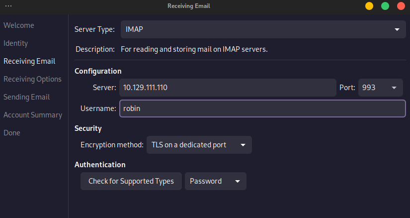

---
layout:
  title:
    visible: true
  description:
    visible: false
  tableOfContents:
    visible: true
  outline:
    visible: true
  pagination:
    visible: false
---

# 143,993 - IMAP

## Nmap Scripts

```bash
# Default script
sudo nmap -p143,993 -sCV $IP
```

## Banner Grabbing

```bash
nc -nv $IP 143
openssl s_client -connect $IP:imaps -quiet
```

## Command

```bash
1 LOGIN username password               # Login with Credentials
1 LIST "" *                             # List all directories
1 CREATE "example.INBOX"                # Create mailbox
1 DELETE "example.INBOX"                # Delete mailbox
1 RENAME "example.INBOX" "Important"    # Rename mailbox
1 LSUB "" *                             # List subscribed mailbox 
1 SELECT example.INBOX                  # Select a mailbox
1 UNSELECT example.INBOX                # Exit from selected mailbox
1 FETCH <ID> all                        # Retrieve message content
1 CLOSE                                 # Close mailbox
1 LOGOUT                                # Logout
```

## Evolution

```bash
sudo apt install evolution -y
```

<figure><figcaption><p>Connecting IMAP through Evolution</p></figcaption></figure>
