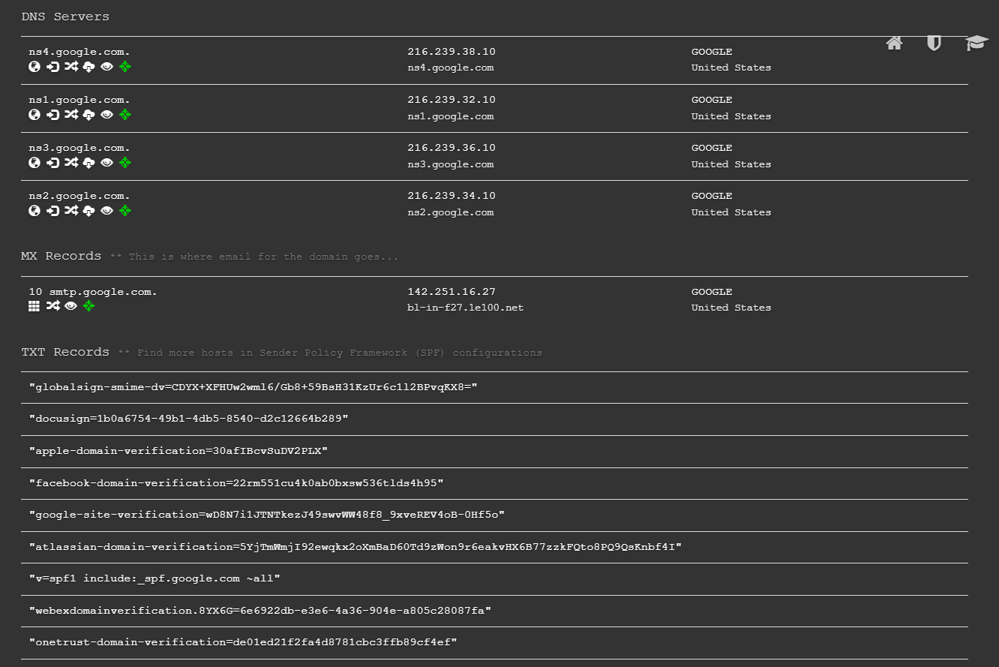

---
layout:
  title:
    visible: true
  description:
    visible: false
  tableOfContents:
    visible: true
  outline:
    visible: true
  pagination:
    visible: false
---

# DNS recon

## Dnsrecon

```bash
# Enumerate general DNS records for a given domain such as MX,SOA,NS,A, etc
dnsrecon -d example.com
```

## Dnsdumpster

* [https://dnsdumpster.com/](https://dnsdumpster.com/)

<figure><figcaption><p>dnsdumpster output</p></figcaption></figure>

